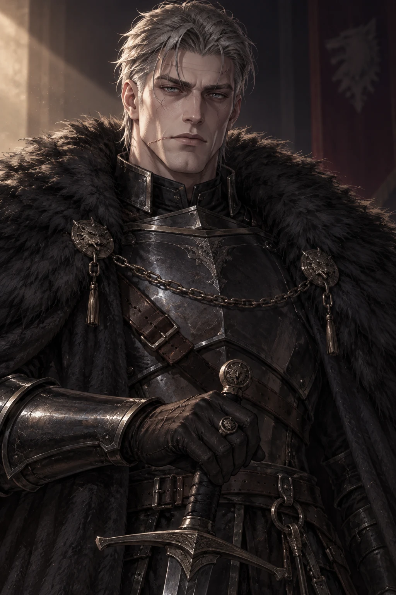
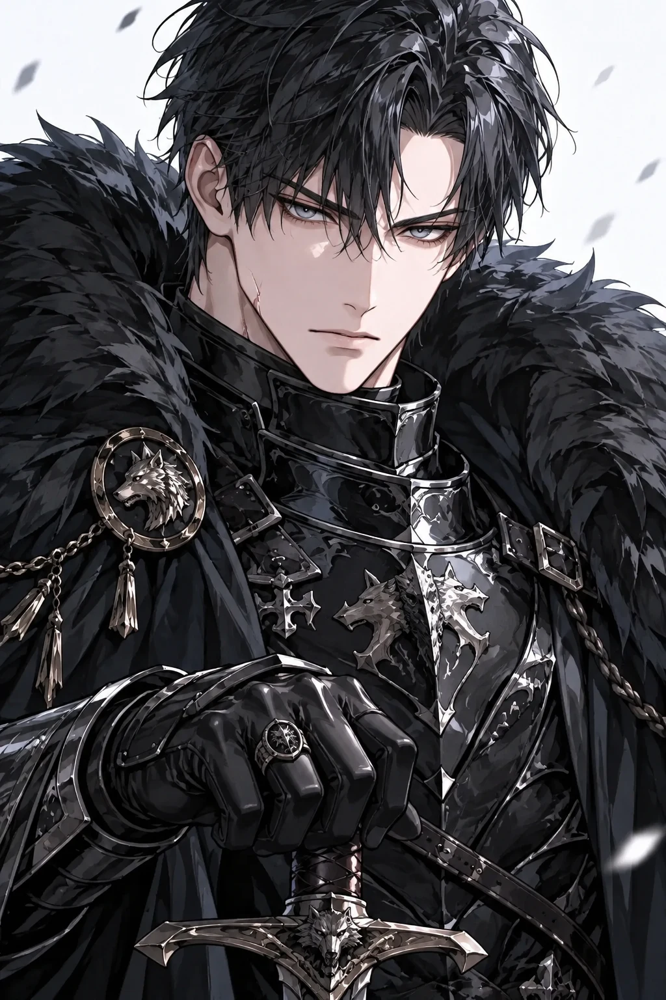

# Wolfgang existing representative images — read-only retrieval

These are **historical live `rep` originals** already stored on production. They are not a new paid generation and not a before/after of this task.

Production SHA at retrieval: `f8bf8c823f86364388fc0261b3a6d36a34777551`.  
Read path: native SSH + unlocked WSL `ssh-agent` (`hav-windows`). No `OfficialSupplyStore` (no DDL). `PRAGMA query_only=ON`.

## EXISTING v1 — `pilot-rf-02`

| Fact | Value |
|---|---|
| draft / slot | `pilot-rf-02` / `rep` |
| style | `romance_fantasy_v1` (`candidate_approved`) |
| batch | `pilot-romance-fantasy-01` (`active`) |
| stage | `asset_plan_locked` |
| status | `generated` (not upload_pending / generating / stale / rejected) |
| attempts | 1 |
| lease | none |
| model | `gpt-image-2.5-sunburst` |
| DB width × height | 1024 × 1536 |
| decoded WebP | 1024 × 1536, `webp` |
| bytes | 226942 |
| SHA-256 | `96f6b043f2ec91bc2c11fd0e2ef4135a08473ab379080aa67aaff2f66b869fe2` |
| appearance lock (char = asset) | `bdd8770e90cb587d0e08d9679439e6d6a565598d0fb7ddcc96b8e2459ae5e7ab` |
| current-main fixture lock | `1c3ccd134203a6dea6ae869c27cc443c42ff5498d1d0130c6f9765407c24dcc3` (**mismatch**) |
| moderation | `checked`; `adultFlagged=false`; `moderationReject=false` |
| spent_usd | 0.029588 |
| unknown cost | 0 |
| stored URL | `/uploads/official-pilot-rf-02__rep-a1.webp` |
| public host | `https://hav.chat/uploads/official-pilot-rf-02__rep-a1.webp` (no query) |

HTTP GET of the public host matched the volume file byte-for-byte (same SHA-256).

## EXISTING Cluster B v4 — `pilot-rf-v4-02`

| Fact | Value |
|---|---|
| draft / slot | `pilot-rf-v4-02` / `rep` |
| style | `romance_fantasy_v4` (`style_locked`) |
| batch | `pilot-romance-fantasy-04-cluster-b` (`active`) |
| stage | `asset_plan_locked` |
| status | `generated` (not upload_pending / generating / stale / rejected) |
| attempts | 1 |
| lease | none |
| model | `gpt-image-2.5-sunburst` |
| DB width × height | 1024 × 1536 |
| decoded WebP | 1024 × 1536, `webp` |
| bytes | 270052 |
| SHA-256 | `a66c49d4d947209206b70a284c99f2e26ef868934ed5426818042c29ba3a45f1` |
| appearance lock (char = asset) | `1c3ccd134203a6dea6ae869c27cc443c42ff5498d1d0130c6f9765407c24dcc3` |
| current-main fixture lock | `1c3ccd134203a6dea6ae869c27cc443c42ff5498d1d0130c6f9765407c24dcc3` (**match**) |
| moderation | `checked`; `adultFlagged=false`; `moderationReject=false` |
| spent_usd | 0.055989 |
| unknown cost | 0 |
| stored URL | `/uploads/official-pilot-rf-v4-02__rep-a1.webp` |
| public host | `https://hav.chat/uploads/official-pilot-rf-v4-02__rep-a1.webp` (no query) |

HTTP GET of the public host matched the volume file byte-for-byte (same SHA-256).

## Notes for GPT (facts only)

- Both files are existing historical candidates, not a new paid run.
- v1 lock hash does not match the current-main Wolfgang Appearance Lock; v4 does.
- Cursor does not score likeness, style, or keep/replace.
- POST 0. DB writes 0. Regeneration 0. Publish 0.
